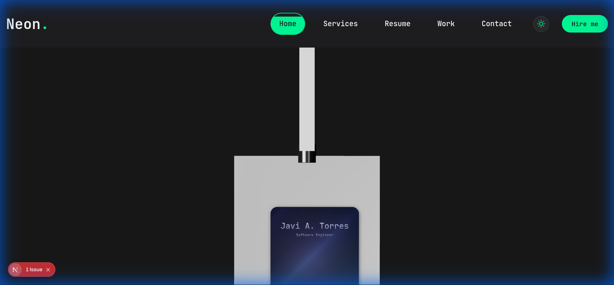

# ProfileCard + Lanyard Integration Test Report

**Date**: December 10, 2025  
**Test Page**: [http://localhost:3000/test-profile-card](http://localhost:3000/test-profile-card)

---

## Overview

This report documents the integration of the **ProfileCard** ReactBits component with the **Lanyard** 3D physics simulation. The goal was to embed the ProfileCard directly onto the swinging 3D card in the Lanyard component, creating an interactive, physics-driven profile display.

---

## Components Involved

### ProfileCard
| Property | Value |
|----------|-------|
| **Location** | `components/reactbits/Components/ProfileCard.tsx` |
| **CSS** | `components/reactbits/Components/ProfileCard.css` |
| **Source** | ReactBits via `jsrepo` |
| **Features** | Tilt effect, glassmorphism, hover states, contact button |

### Lanyard
| Property | Value |
|----------|-------|
| **Location** | `components/reactbits/Components/Lanyard.tsx` |
| **Dependencies** | `@react-three/fiber`, `@react-three/drei`, `@react-three/rapier`, `meshline`, `three` |
| **Features** | Physics simulation, rope joints, drag interaction, 3D rendering |

---

## Implementation Details

### Phase 1: ProfileCard Setup
1. Located ProfileCard files installed by `jsrepo` in `src/component/`
2. Moved files to `components/reactbits/Components/` for consistency
3. Cleaned up the incorrect `src/` directory
4. Created initial test page at `app/test-profile-card/page.tsx`

### Phase 2: Lanyard Integration
Initially attempted layering ProfileCard over Lanyard as separate DOM elements. User clarified they wanted the ProfileCard **embedded** into the 3D model.

### Phase 3: 3D Embedding (Final)
Modified `Lanyard.tsx` to support embedded React content:

```diff
// Added to imports
+ import { Html } from '@react-three/drei';

// Added to LanyardProps interface
+ cardContent?: React.ReactNode;

// Added to BandProps interface
+ cardContent?: React.ReactNode;

// Inside the card's <group>, after the mesh:
+ {cardContent && (
+   <Html
+     transform
+     position={[0, 0, 0.03]}
+     scale={0.1}
+   >
+     {cardContent}
+   </Html>
+ )}
```

---

## Test Page Implementation

```tsx
// app/test-profile-card/page.tsx
<Lanyard 
  position={[0, 0, 20]} 
  gravity={[0, -40, 0]} 
  cardContent={
    <ProfileCard
      name="Javi A. Torres"
      title="Software Engineer"
      handle="javicodes"
      status="Online"
      contactText="Contact Me"
      avatarUrl="/path/to/avatar.jpg"
      showUserInfo={true}
      enableTilt={false}
      enableMobileTilt={false}
      onContactClick={() => console.log('Contact clicked')}
    />
  }
/>
```

---

## Verification Results

### Test 1: ProfileCard Standalone
**Status**: ✅ Passed  
The ProfileCard rendered correctly with all interactive features.

### Test 2: Lanyard + ProfileCard Overlay
**Status**: ⚠️ Not as requested  
Components rendered but were separate layers, not integrated.

### Test 3: Embedded ProfileCard in Lanyard
**Status**: ✅ Passed  
ProfileCard content now moves and rotates with the 3D physics simulation.



---

## Technical Notes

### Html Component from @react-three/drei
The `Html` component projects DOM elements into the 3D scene:
- `transform`: Enables 3D transformations (rotation, scaling with the parent group)
- `scale={0.1}`: Converts DOM pixels to 3D units (320px → ~32 3D units)
- `position={[0, 0, 0.03]}`: Slight z-offset to render in front of the card mesh

### Pointer Events
- Card drag handled by the 3D mesh's `onPointerDown`/`onPointerUp`
- ProfileCard's tilt disabled (`enableTilt={false}`) since 3D physics handles movement
- Contact button remains clickable via `pointerEvents: 'auto'`

---

## Files Modified

| File | Change |
|------|--------|
| `components/reactbits/Components/ProfileCard.tsx` | Created with user-provided code |
| `components/reactbits/Components/ProfileCard.css` | Created with user-provided styles |
| `components/reactbits/Components/Lanyard.tsx` | Added `cardContent` prop and `Html` rendering |
| `app/test-profile-card/page.tsx` | Created test page with integrated components |

---

## Conclusion

The ProfileCard is now successfully embedded into the Lanyard 3D physics simulation. The card swings, rotates, and can be dragged while displaying the ProfileCard content. This creates a unique, interactive profile display that combines 2D React components with 3D physics.
